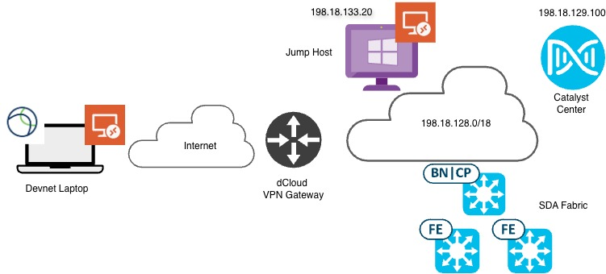

# Lab Topology

The lab environment includes a Catalyst Center and a Fabric Site.
You will use the Cisco Secure Client on your laptop to establish a VPN session with the dCloud VPN gateway for your assigned POD.

Once the VPN session is established use the RDP client on your laptop to RDP to the Windows Jump host and execute the steps suggested in the lab guides.

