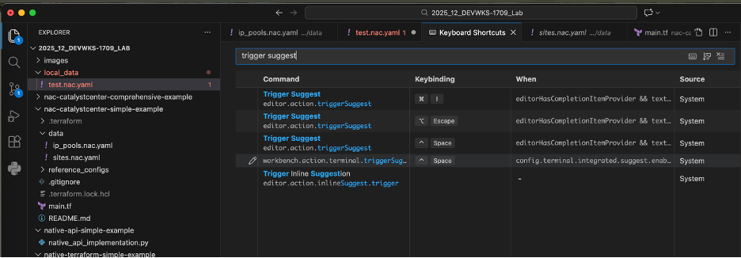
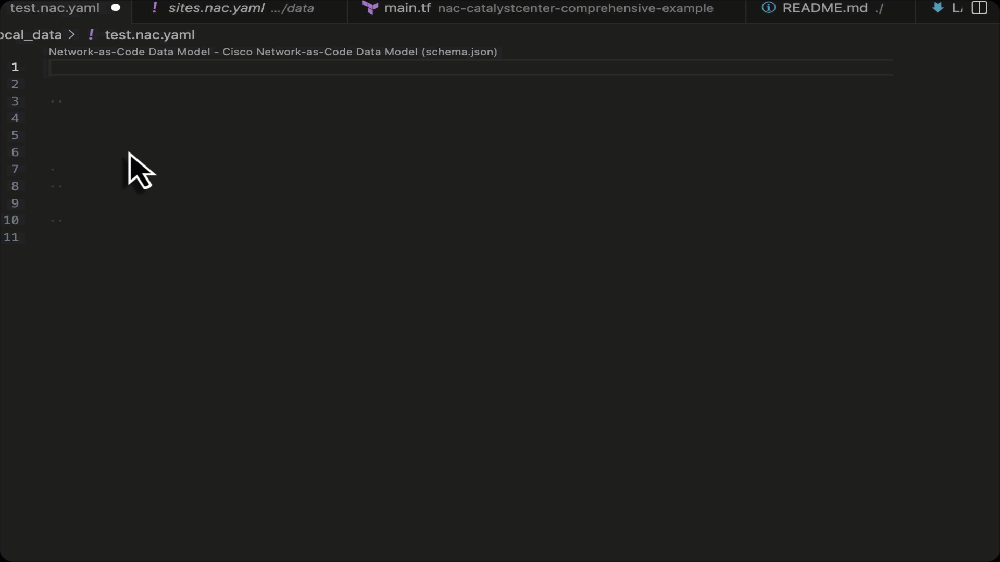

# Step 1 - Simple Example Deployment with NaC for Catalyst Center

This folder demonstrates the **Network-as-Code (NAC) Module** approach to configuring Cisco Catalyst Center using YAML-based declarative configuration.

## Lab Access

If not already done, follow the [Lab Access Guide](./lab_access.md) to access the Lab and clone the repositories

## 🎯 What This Example Does

Deploys a complete network infrastructure to Catalyst Center:

- **5 Areas**: United States, Golden Hills Campus, Lakefront Tower, Oceanfront Mansion, Desert Oasis Branch
- **4 Buildings**: Sunset Tower, Windy City Plaza, Art Deco Mansion, Desert Oasis Tower  
- **6 Floors**: Multiple floors across different buildings
- **4 Global IP Pools**: US_CORP (10.201.0.0/16), US_TECH (10.202.0.0/16), US_GUEST (10.203.0.0/16), US_BYOD (10.204.0.0/16)
- **16 IP Pool Reservations**: 4 reservations per building (CORP, TECH, GUEST, BYOD)

**Total Resources Created**: 35

## Access the DEVWKS-1709/nac-catalystcenter-simple-example folder

Access the cloned repository folder for this lab.

You should have already launched visual studio code from the DEVWKS-1709 folder.

You should now open a new terminal from code and access the nac-catalystcenter-simple-example folder


## 📁 File Structure

```
nac-catalystcenter-simple-example/
├── main.tf                    # Terraform configuration using NAC module
├── data/
│   ├── sites.nac.yaml        # Site hierarchy (areas, buildings, floors)
│   └── ip_pools.nac.yaml     # IP pools and reservations
└── reference_configs/
    ├── initial_config/        # Base US-only configuration
    │   ├── sites.nac.yaml     # Initial site hierarchy
    │   └── ip_pools.nac.yaml  # Initial IP pools
    └── final_config/          # Complete configuration with Rome
        ├── sites.nac.yaml     # Final site hierarchy
        └── ip_pools.nac.yaml  # Final IP pools
```

**Note**: The `reference_configs` folder is provided for learning and validation purposes. It contains both the initial configuration (US sites only) and the final configuration (with Rome office added) that you'll work towards during the lab exercises.

## 🚀 Quick Start

The NAC approach enforces a strict **separation of data from code** - a key principle that simplifies maintenance and enables reusability:
  
- **Code** (`main.tf`): Minimal "glue" file that links data to the NAC module
  - References the community-maintained NAC module from Terraform registry
  - Rarely changes - only when updating module version or directory structure

- **Data** (`data/` directory): Contains the desired state of your network in YAML files
  - Site hierarchy, IP pools, network settings - everything specific to YOUR environment
  - Can be updated independently without touching the Terraform code

This separation means you maintain only your network's desired state (YAML data), while the complex Terraform logic is handled by the centrally-maintained NAC module. Multiple teams can use the same proven codebase with their own configuration data.

**Learn More:** [Separate Data from Code Concept](https://netascode.cisco.com/docs/guides/concepts/separate_data_from_code/)

### 1. main.tf file

The `main.tf` file is the entry point for your Terraform deployment. It defines:

- **Provider Configuration**: Which Terraform provider to use (Catalyst Center)
- **Authentication**: How to connect to your Catalyst Center instance (URL, credentials)
- **NAC Module**: References the Network-as-Code module for simplified configuration
- **YAML Location**: Specifies where your configuration files are located (`data/` directory)

#### 1.1 Inspect the main.tf file

The `main.tf` is already modified to point to your Catalyst Center:

### 2. Inspect Data Folder

The `data/` folder organizes network configuration into multiple YAML files for better readability and maintainability:

```
data/
├── sites.nac.yaml        # Site hierarchy (areas, buildings, floors)
└── ip_pools.nac.yaml     # IP pools and reservations
```

**YAML Merging:**
The NAC module automatically merges multiple YAML files into a single configuration. This allows you to organize complex configurations by function or environment. The merging process:

- **Deep Merges Dictionaries**: Files with the same keys are combined, merging nested structures
- **Appends Lists**: List items from multiple files are combined into a single list
- **Matches by Primitive Keys**: For lists of dictionaries, items are merged if they share matching primitive values (like `name`)
- **Preserves Structure**: Nested configurations are merged recursively, maintaining hierarchy

This modular approach lets you split large configurations (e.g., separate files for sites, IP pools, network settings) while the NAC module handles combining them automatically.

**Learn More:** [Merging YAML Files](https://netascode.cisco.com/docs/guides/concepts/merging_yaml/)

### 3. Inspect YAML Files

The NAC module uses two YAML files to define the network infrastructure in a hierarchical, human-readable format.

#### 3.1 About YAML

YAML (YAML Ain't Markup Language) is a human-readable data serialization format commonly used for configuration files. Key syntax rules:

- **Indentation Matters**: Use spaces (not tabs) - typically 2 spaces per level
- **Key-Value Pairs**: Format is `key: value` with a space after the colon
- **Lists**: Use a dash (`-`) followed by a space for list items
- **Nesting**: Child elements are indented under their parent
- **Comments**: Start with `#` and continue to end of line
- **Case Sensitive**: `name` and `Name` are different keys

### 3.2 Network-as-Code YAML Files

Files with the `.nac.yaml` suffix leverage the **Network-as-Code Data Model JSON Schema** for validation and auto-completion. This provides:

- **Error Checking**: Validates configuration against the data model before deployment
- **IntelliSense**: IDE support for available options and attributes for each object
- **Type Safety**: Ensures correct data types and required fields are present
- **Documentation**: Built-in schema documentation for all available properties

This schema-based approach catches configuration errors early and guides you with available options as you write your YAML files.

#### 3.2.1 Using IntelliSense

IntelliSense provides intelligent code completion suggestions as you type your YAML configuration. To manually trigger IntelliSense at any point in your file:

- **Windows/Linux**: Press `Ctrl+Space`
- **Mac**: `Option+Esc` (⌥ + Esc)
  - **Note**: `Control+Space` might be an alternative but may conflict with macOS system shortcuts for switching input sources or Spotlight. 

If these shortcuts don't work or conflict with other system functions, you can check the current configuration and customize it within Visual Studio Code. To do this, go to Code > Preferences > Keyboard Shortcuts and search for "Trigger Suggest"



IntelliSense will display all available properties for the current context, including descriptions and expected data types. 
The example below shows how to use intellisense in nac.yaml files



For more information on using IntelliSense features, see the [VS Code IntelliSense documentation](https://code.visualstudio.com/docs/editing/intellisense).

### 3.3 Site Hierarchy (`data/sites.nac.yaml`)

Defines the organizational structure: areas, buildings, and floors. The base configuration includes US-based sites:

```yaml
---
catalyst_center:
  sites:
    areas:
      - name: United States
        parent_name: Global
      - name: Golden Hills Campus
        parent_name: Global/United States
    
    buildings:
      - name: Sunset Tower
        latitude: 34.099
        longitude: -118.366
        address: 8358 Sunset Blvd, Los Angeles, CA 90069
        country: United States
        parent_name: Global/United States/Golden Hills Campus
        ip_pools_reservations:
          - ST_CORP
          - ST_TECH
          - ST_GUEST
          - ST_BYOD
    
    floors:
      - name: Floor 1
        parent_name: Global/United States/Golden Hills Campus/Sunset Tower
        floor_number: 1
```

**Key Points:**
- `parent_name` creates the hierarchy using slash-separated paths
- Buildings include geographic coordinates and addresses
- IP pool reservations are referenced by name

**Data Model Overview:**
The `sites` class supports areas, buildings, and floors with:
- **Credential Management**: CLI, SNMPv2/v3, HTTPS credentials at any hierarchy level
- **Network Settings**: AAA servers, network configuration, and telemetry settings
- **IP Pool Reservations**: Reference pools by name for automatic site-specific allocation
- **Hierarchical Structure**: Use slash-separated paths (e.g., `Global/Americas/USA`)

**Full Documentation:** [Catalyst Center Sites Data Model](https://netascode.cisco.com/docs/data_models/catalyst_center/sites/area/)

### 3.4 IP Pools (`data/ip_pools.nac.yaml`)

Defines global IP pools and site-specific reservations for US locations:

```yaml
---
catalyst_center:
  network_settings:
    ip_pools:
      - name: US_CORP
        ip_address_space: IPv4
        ip_pool_cidr: 10.201.0.0/16
        dhcp_servers:
          - 10.201.0.2
        dns_servers:
          - 10.201.0.2
        ip_pools_reservations:
          - name: ST_CORP
            prefix_length: 24
            subnet: 10.201.2.0
          - name: DOT_CORP
            prefix_length: 24
            subnet: 10.201.1.0
```

**Key Points:**
- Each global pool contains multiple site-specific reservations
- DHCP and DNS servers are defined at the pool level
- Reservations inherit settings from their parent pool

**Full Documentation:** [Network Settings](https://netascode.cisco.com/docs/data_models/catalyst_center/network_settings/network/) | [IP Pool Data Model](https://netascode.cisco.com/docs/data_models/catalyst_center/network_settings/ip_pool/)

### 4. Verify Initial Catalyst Center Configuration

Before deploying any configuration, verify that Catalyst Center has no sites or IP address pools configured:

1. Login to the Catalyst Center GUI using your credentials
2. Navigate to **Design > Network Hierarchy** to verify no sites exist (only the default "Global" site should be present)
3. Navigate to **Design > Network Settings > IP Address Pools** to verify no IP pools are configured

This baseline verification ensures you're starting with a clean slate and will help you clearly see the resources created by Terraform in the next step.

### 5. Deploy Base Configuration

Deploy the initial US-based network infrastructure:

```bash
terraform init
```

Review the changes:
```bash
terraform plan
```

Deploy to Catalyst Center:
```bash
terraform apply
```

**Expected Result**: ✅ Success on first apply - all 35 resources created

- 5 Areas (United States + 4 campus/branch areas)
- 4 Buildings (Sunset Tower, Windy City Plaza, Art Deco Mansion, Desert Oasis Tower)
- 6 Floors across the buildings
- 4 Global IP Pools (US_CORP, US_TECH, US_GUEST, US_BYOD)
- 16 IP Pool Reservations (4 per building)

### 6. Verify Catalyst Center Configuration

After the successful Terraform deployment, verify that the sites and IP address pools have been configured correctly in Catalyst Center:

1. **Login to Catalyst Center GUI** using your credentials

2. **Verify Site Hierarchy**:
   - Navigate to **Design > Network Hierarchy**
   - Confirm all 5 areas are present:
     - United States
     - Golden Hills Campus
     - Lakefront Tower
     - Oceanfront Mansion
     - Desert Oasis Branch
   - Expand each area to verify the 4 buildings and their 6 floors are correctly created

3. **Verify IP Address Pools**:
   - Navigate to **Design > Network Settings > IP Address Pools**
   - Confirm all 4 global IP pools exist:
     - US_CORP (10.201.0.0/16)
     - US_TECH (10.202.0.0/16)
     - US_GUEST (10.203.0.0/16)
     - US_BYOD (10.204.0.0/16)
   - Click on each pool to verify the 4 reservations per building (16 total)
   - Confirm each reservation shows the correct subnet allocation and parent pool

This verification step ensures your Terraform deployment successfully created all the expected resources before proceeding with incremental changes.

## 🔄 Making Changes

### 7. Adding a New Site

Now let's expand to Europe by adding a Rome office. This requires editing `data/sites.nac.yaml` to add three types of resources: areas, a building, and a floor.

#### 7.1 Edit `data/sites.nac.yaml`

This file contains all site hierarchy definitions. We'll add European locations to the existing US structure.

##### 7.1.1 Add Area Hierarchy

**Current Context** - The `areas` section contains US locations:
```yaml
---
catalyst_center:
  sites:
    areas:
      - name: United States
        parent_name: Global
      - name: Golden Hills Campus
        parent_name: Global/United States
      # ... other US areas ...
```

**New Code** - Add these three area levels for Europe at the end of the existing **areas** section:
```yaml
# NEW: European area hierarchy
- name: Europe
  parent_name: Global
- name: Italy
  parent_name: Global/Europe
- name: Rome
  parent_name: Global/Europe/Italy
```

##### 7.1.2 Add Building

**Current Context** - The `buildings` section contains US buildings:
```yaml
    buildings:
      - name: Sunset Tower
        latitude: 34.099
        longitude: -118.366
        # ... other attributes ...
      # ... other US buildings ...
```

**New Code** - Add the Rome office at the end of the existing **buildings** section:
```yaml
# NEW: Rome office building
- name: Rome Office
  latitude: 41.832002
  longitude: 12.491654
  address: Via Del Serafico 200, 00142 Roma Rome, Italy
  country: Italy
  parent_name: Global/Europe/Italy/Rome
```

##### 7.1.3 Add Floor

**Current Context** - The `floors` section contains US floors:
```yaml
    floors:
      - name: FLOOR_1
        floor_number: 1
        parent_name: Global/United States/Golden Hills Campus/Sunset Tower
      # ... other US floors ...
```

**New Code** - Add the Rome office floor at the end of the existing list of floors:
```yaml
# NEW: Rome office floor
- name: FLOOR_1
  floor_number: 1
  parent_name: Global/Europe/Italy/Rome/Rome Office
```

#### 7.2 Verify your changes against the reference configurations

**After completing these modifications**, your `data/sites.nac.yaml` file should look like the reference file in the `nac-catalystcenter-simple-example/reference_configs/final_config` folder with the exception of the ip_pools_reservations that we will add in the next step

Verify your changes reviewing the file or running the command below in terminal from `nac-catalystcenter-simple-example` folder:

```bash
diff -c data/sites.nac.yaml reference_configs/final_config/sites.nac.yaml
```

**What We're Adding**:

- **3 Area Levels**: Europe → Italy → Rome hierarchy
- **1 Building**: Rome Office with coordinates and address
- **1 Floor**: Ground floor
- **Total**: 5 new resources with just 18 lines of YAML

**Key Points**:

- Each area references its parent using slash-separated paths
- The building references the complete hierarchy path
- No IP pool reservation yet - we'll add that in the next step
- No dependencies to manage - NAC module handles ordering automatically

#### 7.3 Deploy the Site Addition

**Deploy the Site Addition**:

Review the changes:
```bash
terraform plan
```

Deploy new site:
```bash
terraform apply
```

**Expected Result**: ✅ 5 new resources added (3 areas, 1 building, 1 floor)

#### 7.4 Verify in Catalyst Center

**Verify in Catalyst Center**: 

- Refresh your browser page in the Catalyst Center GUI
- Navigate to **Design > Network Hierarchy** 
- Expand **Global** to verify the new **Europe > Italy > Rome** hierarchy appears
- Verify the **Rome Office** building with its floor is visible under the Rome area

### 8. Adding IP Pools for New Site

Now add IP addressing for the Rome office. This requires changes to two files: creating a global IP pool in `ip_pools.nac.yaml` and referencing it in `sites.nac.yaml`.

#### 8.1 Edit `data/ip_pools.nac.yaml`

This file contains global IP pools and their reservations.

##### 8.1.1 Add European IP Pool

**Current Context** - The `ip_pools` section contains US pools:
```yaml
---
catalyst_center:
  network_settings:
    ip_pools:
      - name: US_CORP
        ip_address_space: IPv4
        ip_pool_cidr: 10.201.0.0/16
        # ... pool configuration ...
      - name: US_TECH
        # ... pool configuration ...
      # ... other US pools (US_GUEST, US_BYOD) ...
```

**New Code** - Add the European corporate pool with Rome reservation:
```yaml
# NEW: European corporate IP pool
- name: EU_CORP
  ip_address_space: IPv4
  ip_pool_cidr: 10.205.0.0/16
  dns_servers:
    - 10.205.0.1
  dhcp_servers:
    - 10.205.0.1
  ip_pools_reservations:
    - name: ROM_CORP
      prefix_length: 24
      subnet: 10.205.1.0
```

#### 8.2 Edit `data/sites.nac.yaml`

Update the Rome Office building to reference the IP pool reservation.

##### 8.2.1 Add IP Pool Reservation to Building

**Current Context** - The Rome Office building (added in step 5):
```yaml
- name: Rome Office
  latitude: 41.832002
  longitude: 12.491654
  address: Via Del Serafico 200, 00142 Roma Rome, Italy
  country: Italy
  parent_name: Global/Europe/Italy/Rome
```

**New Code** - Add the `ip_pools_reservations` field:
```yaml
ip_pools_reservations:
  - ROM_CORP
```

**Result** - The complete updated building entry:
```yaml
- name: Rome Office
  latitude: 41.832002
  longitude: 12.491654
  address: Via Del Serafico 200, 00142 Roma Rome, Italy
  country: Italy
  parent_name: Global/Europe/Italy/Rome
  ip_pools_reservations:  # NEW: Reference the IP pool reservation
    - ROM_CORP
```

#### 8.3 Verify your files against the reference files

**After completing all IP pool modifications**, verify your files against the reference files:

- `data/ip_pools.nac.yaml` should match: `reference_configs/final_config/ip_pools.nac.yaml`
- `data/sites.nac.yaml` should match: `reference_configs/final_config/sites.nac.yaml`

Verify your changes reviewing the files or running the command below in terminal from `nac-catalystcenter-simple-example` folder:

Verify your changes to `ip_pools.nac.yaml`:
```bash
diff -c data/ip_pools.nac.yaml reference_configs/final_config/ip_pools.nac.yaml
```

Verify your changes to `sites.nac.yaml`:
```bash
diff -c data/sites.nac.yaml reference_configs/final_config/sites.nac.yaml
```

**What We're Adding**:

- **1 Global IP Pool**: EU_CORP (10.205.0.0/16) for all European sites
- **1 IP Pool Reservation**: ROM_CORP (10.205.1.0/24) carved from the global pool
- **Total**: 2 new resources

**Key Points**:

- The global pool can support multiple European sites with /24 subnets
- The reservation is defined once in `ip_pools.nac.yaml`
- The building simply references the reservation by name
- DHCP and DNS settings are inherited from the parent global pool
- NAC module automatically creates pool → reservation → site association in the correct order

#### 8.4 Deploy the IP Pool Addition

**Deploy the IP Pool Addition**:

Review the changes:
```bash
terraform plan
```

Deploy IP pools:
```bash
terraform apply
```

**Expected Result**: ✅ 2 new resources added (1 global pool, 1 reservation)

#### 8.5 Verify in Catalyst Center

**Verify in Catalyst Center**:

- Refresh your browser page in the Catalyst Center GUI
- Navigate to **Design > Network Settings > IP Address Pools**
- Verify the **EU_CORP** pool (10.205.0.0/16) appears in the list
- Click on **EU_CORP** to view details and confirm the **ROM_CORP** reservation (10.205.1.0/24) is present
- Navigate to **Design > Network Hierarchy** and check the **Rome Office** building to verify the IP pool reservation is associated

**Total New Resources**: 7 (5 site resources + 2 IP pool resources)
**Total Lines Added**: ~30 lines across two YAML files

### 9. Clean Up

To remove all deployed resources from Catalyst Center:

```bash
terraform destroy  # Remove all 35 resources
```

**Note**: Terraform will show you a plan of what will be destroyed and ask for confirmation before proceeding.

**Verify in Catalyst Center**:

- Refresh your browser page in the Catalyst Center GUI
- Navigate to **Design > Network Hierarchy** to confirm no sites exist (only the default "Global" site should be present)
- Navigate to **Design > Network Settings > IP Address Pools** to verify no IP pools are configured
- This confirms all resources have been successfully destroyed and your environment is back to the clean baseline state


## ✅ Key Benefits

1. **Simple & Intuitive**: YAML configuration mirrors network hierarchy naturally
2. **Automatic Dependencies**: Module handles resource ordering automatically
3. **No Schema Knowledge Required**: Intuitive field names (no `ip_subnet` vs `ip_pool_cidr` confusion)
4. **Built-in Validation**: Module catches configuration errors before deployment
5. **Maintainable**: Easy to update - change YAML, run `terraform apply`
6. **Production Ready**: Includes error handling, retries, and state management


## 🔗 Resources

- **Original Example**: [nac-catalystcenter-simple-example](https://github.com/netascode/nac-catalystcenter-simple-example/)
- **NAC Module**: [terraform-catalystcenter-nac-catalystcenter](https://registry.terraform.io/modules/netascode/nac-catalystcenter/catalystcenter/latest)
- **Module Documentation**: [GitHub Repository](https://github.com/netascode/terraform-catalystcenter-nac-catalystcenter)
- **Catalyst Center Provider**: [CiscoDevNet Provider](https://registry.terraform.io/providers/CiscoDevNet/catalystcenter/latest)


